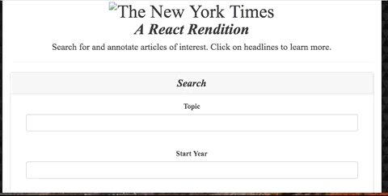
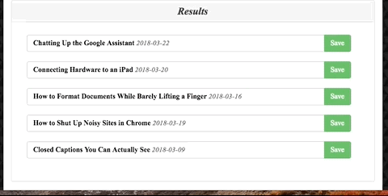
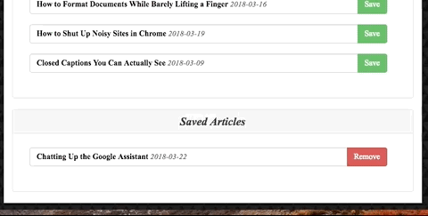

# NYT Articles Search


## Overview
The app is created on a new React-based rendition of the New York Times Article Search application. The included React components, work with helper/util functions, and utilize the React mounting lifecycle to query and display articles based on user searches. The users can save articles using Node, Express and MongoDB.

## To Run
```yarn install```

## Demo
* Scrape Articles



* Save Articles




* Delete Articles




## Technologies used 
- Node.js
- React
- axios NPM Package - https://www.npmjs.com/package/axios
- body-parser NPM Package - https://www.npmjs.com/package/body-parser
- express NPM Package - https://www.npmjs.com/package/express
- mongoose NPM Package - https://www.npmjs.com/package/mongoose
- morgan NPM Package - https://www.npmjs.com/package/morgan

## Author
**Julie Nguyen** https://newyorktimestreact.herokuapp.com/